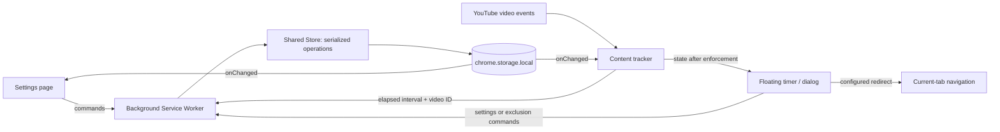
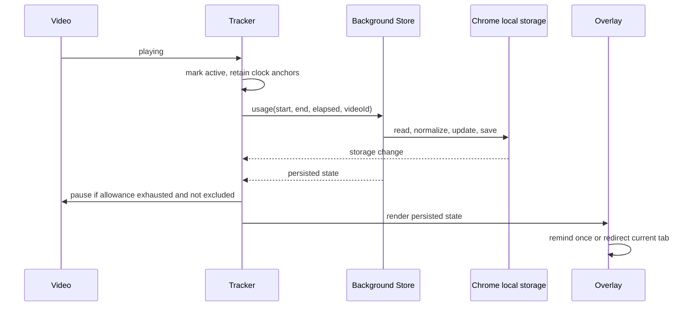

# Technical architecture

## System boundary

This is one Chrome extension with several execution contexts, not a client/server web application. Its data stays on the device. The local prototype server is development tooling only and is not part of the installed extension.

| Layer | Responsibility | Does not own |
| --- | --- | --- |
| Settings UI | Forms, localization, validation feedback and current usage | Video playback or direct storage writes |
| Content adapter | YouTube route events, video lookup, storage notifications and cleanup | Durable state ownership |
| Tracker | Playback transitions, elapsed intervals, exclusions and pause enforcement | DOM presentation or Chrome APIs |
| Overlay | Shadow DOM timer, native modal, end-action deduplication | Time accumulation or storage policy |
| Service Worker | Chrome message adapter and one Store instance | A continuously running clock or HTTP API |
| Shared domain | Input validation, normalization, daily/session rules and queued persistence | Browser UI |

## Runtime loading

The root manifest names the background worker, the settings document and the ordered content-script list. Shared scripts load first, followed by the tracker, overlay and content adapter. Settings imports the same shared domain and translation code. The background worker imports the domain through a relative `importScripts` path.

The small shared modules expose browser globals and CommonJS exports so the same source runs in Chrome and dependency-free Node tests. There is no bundler. This keeps the MVP inspectable, but requires explicit script order; `npm run check` validates paths and syntax after changes. A future ES-module/build migration should preserve these runtime boundaries rather than merely add tooling.

## Playback and enforcement flow

`play` expresses intent; `playing` confirms playback. Pause, end, waiting, seeking, emptied and error events settle the previous interval and stop accrual. Each document owns one discovery/settlement interval and a removable set of handlers for the currently tracked video. The video ID is tracked separately from the element because YouTube can reuse the same element across routes.

Enforcement runs before the UI callback. This guarantees that a configured redirect is initiated after the video's pause request. Closing a dialog changes presentation only; it does not change the budget. Increasing an allowance never starts playback automatically.

## Two clocks and two budgets

- `performance.now()` measures elapsed active time. Counting callback invocations would undercount when a timer is delayed.
- Local wall time identifies the daily bucket and session start boundary.
- A cross-midnight interval contributes only its proportional overlap with the new day.
- Daily and temporary limits are stored separately. A temporary start establishes a new origin and does not alter the daily default.
- A temporary override expires at local midnight. The next request restores daily mode even if the worker was asleep at midnight.
- Manual correction replaces only the missing contribution needed to reach the submitted total. The automatic total stays intact. The target date is validated to avoid applying a stale correction to the next day.

A monotonic clock is useful but is not a guarantee of human attention or identical behavior through OS sleep. Manual clock changes and suspension remain documented limitations.

## Durable state

One object is stored under the `usage` key. This remains compatible with the earlier root-level implementation.

| Field | Meaning |
| --- | --- |
| `day` | Local `YYYY-MM-DD` bucket |
| `watchedMs` | Today's automatically recorded eligible playback |
| `manualMs` | Additional manually supplied time for today |
| `dailyLimitSeconds` | Recurring daily allowance |
| `sessionLimitSeconds` | Last configured temporary allowance |
| `mode` | `daily` or `session` |
| `session` | Same-day start timestamp and watched milliseconds, or null |
| `limitSeconds`, `limitMinutes` | Derived active-limit aliases retained for compatibility |
| `limitAction`, `redirectUrl` | Reminder/redirect preference and validated destination |
| `excludedVideos` | Canonical video IDs and optional user labels |
| `language` | English by default; explicit Chinese preference preserved |

Normalization migrates legacy minute-based data, preserves valid preferences and initializes missing fields. Day rollover resets only date-scoped totals and the temporary override. Persistent settings, exclusions and language survive.

## Consistency and failure model

All installed-extension writes go through one background Store. Each request chains onto a Promise queue, then reads the latest value, applies domain rules and persists before acknowledging. Concurrent tabs therefore do not overwrite each other's totals through independent read-modify-write operations. A failed operation is reported without permanently poisoning the queue.

This is single-process serialization, not a database transaction or distributed exactly-once protocol. A worker or browser can terminate around an in-flight write or response. No event ID ledger, deduplication log or automatic ambiguous-write retry is implemented. The current choice favors simple behavior and small normal loss windows over a false durability guarantee.

Storage notifications keep settings and content views current. Unchanged status requests do not rewrite the object. The active playback tick usually persists once a second, with additional settlements on state transitions. This favors prompt enforcement and crash-loss bounds over aggressive storage batching; actual performance cost still needs measurement.

## Exclusions and end actions

An exclusion is keyed by a validated 11-character video ID, not a URL string. Watch URLs, short links and time-stamped links canonicalize to the same ID. The tracker avoids reporting excluded time and bypasses the pause condition. The background also rejects late usage contributions for an ID currently excluded. The overlay suppresses dialogs and redirects for that video.

Only HTTP(S) redirect destinations without embedded credentials are accepted, and direct YouTube destinations are rejected. The current tab uses `location.replace` to avoid returning straight to the same exhausted page through the immediate history entry. Redirects and dialogs are deduplicated for the current limit event. Arbitrary labels are rendered as text, not HTML.

## Why no separate backend?

Today's requirements are single-device storage, immediate playback control and personal preferences. None require a network service. Authentication, hosting, a database and synchronization would increase operational and privacy scope without solving the current problem.

A server becomes reasonable when the product requires cross-device budgets, account recovery or shared policy management. That would introduce new decisions:

1. Define a device identity, user identity and consent model.
2. Send idempotent usage events with durable event IDs, rather than overwriting a shared aggregate.
3. Specify offline allowance behavior, duplicate delivery and reconciliation.
4. Decide whether the budget is authoritative on the server and how network failure affects playback.
5. Define retention, deletion and export behavior before collecting viewing data.

These are future design questions, not implemented features. Avoid adding empty `frontend/` and `backend/` projects merely to suggest a server exists.

## Verification boundary

Domain tests use injected clocks/storage. Adapter tests run the actual entry scripts against browser-like APIs, including receiver-sensitive timer functions. Overlay tests exercise presentation and action policy. The prototype runs real production UI and tracker code with simulated media events.

None of those validate YouTube decoding, actual Chrome worker suspension, real storage latency, or dropped-frame performance. See [Testing](testing.md) and [Performance investigation](performance.md).
