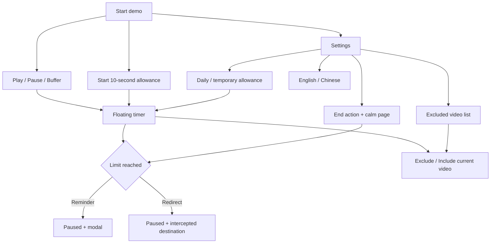

# Interactive prototype

## Purpose

Demonstrate the product's decisions and interaction flows without installing the extension or depending on live YouTube playback. This is a functional prototype built from production components, not a screenshot-only mockup and not an end-to-end Chrome test.

## Run

```sh
npm run prototype
```

Open [the demo](http://127.0.0.1:8765). The Node server binds to loopback only. Stop it with Ctrl+C. It serves only public source/prototype HTML, CSS and JavaScript; repository metadata and unrelated files are not exposed.

## Screen map



The demo stage contains a simulated player, transport buttons, scenario shortcuts and the real floating timer. The **Preview settings** screen embeds the real production settings document, with an injected mock Chrome adapter and a visible prototype label.

## Suggested two-minute demo

1. Click **Start demo**. This resets demo data and starts simulated playback automatically.
2. Watch the fresh 10-second allowance count down in the floating timer.
3. Click **Buffer**: accrual stops. Click **Play** to resume, then **Skip 10 seconds** to reach the limit quickly.
4. Dismiss the reminder. Pressing Play should remain blocked; dismissing a dialog does not grant more allowance.
5. Use **Exclude** in the floating timer. The current video is exempt; press Play manually. Switch videos to show that the exclusion is video-specific.
6. Open **Preview settings**. Switch language, inspect the exclusion list and adjust a limit. The demo's state is shared with the watch view.
7. Click **Restart demo**, expand **Explore more scenarios**, then choose **3 hours watched / 1-hour limit** to explain daily totals. Choose **Next day** to demonstrate automatic allowance restoration.
8. Choose **Try redirect**, which starts with fresh demo data. At the limit, playback pauses and the destination is logged instead of opening an external page.

## Implementation

| File | Role |
| --- | --- |
| `prototype/index.html` | Screen layout, navigation and scenario controls |
| `prototype/prototype.css` | Demo shell styling only |
| `prototype/mock-runtime.js` | One queued domain Store, Chrome-like messaging/events and demo session storage |
| `prototype/watch.js` | Simulated media events, controlled clock advances and scenario orchestration |
| `scripts/prototype-server.cjs` | Local asset serving and settings-only mock injection |

The prototype imports `src/shared/core.js`, `src/shared/i18n.js`, `src/content/tracker.js` and `src/content/overlay.js` directly. The settings iframe is served from `src/options/index.html`; the development server injects the adapter before the production settings controller. Production files contain no prototype import.

The demo uses a same-tab shared runtime, with session storage under a prototype-specific key. It overrides `Date.now` only inside the prototype contexts so settings render the simulated date correctly. The wall and elapsed clocks move together when using scenario controls. Reloading resets the simulated clock offset; use **Restart demo** for a reproducible starting point.

Video A and Video B use synthetic IDs. There is no media stream, network fetch, video decoding, real Chrome API or connection to installed-extension storage. The prototype does not verify browser worker lifecycle, actual YouTube event ordering, fullscreen integration or playback smoothness.

## Portfolio use

Use this prototype for a short live walkthrough or record your own screenshots/video. Label it as simulated. Explain how the same production state machine and UI are exercised through different adapters; that is the architectural point of the prototype.

A public website would need its own hosting work and a deliberate data policy. This repository currently provides a local demo only; it has not been published. Avoid claiming server-backed synchronization or measured performance improvements when presenting it.

## Guided entry

Click **Start demo** to reset only the isolated demo store and begin a fresh 10-second session automatically. The simulated player progress advances, the production floating timer counts down, and the real reminder appears at the limit. **Restart demo** repeats the walkthrough. Playback and scenario controls belong to the showcase; the floating timer and reminder belong to the extension. The timer is hidden until a demo starts. Additional scenarios are grouped under **Explore more scenarios**.
